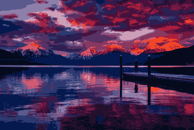

# Sprite Generator

A Python-based pixel art sprite generator that converts photographic images into stylized pixel art using color quantization and clustering algorithms.

## Overview

This program transforms high-resolution images into low-resolution pixel art sprites through a combination of image processing techniques and unsupervised machine learning. The tool applies K-means clustering to reduce the color palette of an image while maintaining visual coherence, enabling the creation of retro-style game sprites or artistic pixel art from any input image.

### Example Comparison

<table>
<tr>
<td></td>
<td></td>
</tr>
<tr>
<td align="center"><b>Original Image</b></td>
<td align="center"><b>Generated Sprite</b></td>
</tr>
</table>

## Features

- **Configurable Output Resolution**: Specify custom width and height for generated sprites
- **Color Palette System**: Apply predefined color palettes or use automatic color extraction
- **Custom K-Means Implementation**: Pure NumPy implementation of K-means clustering for color quantization
- **Multiple Color Palettes**: Built-in support for Game Boy, pastel, monochrome, and vibrant color schemes
- **Flexible Color Quantization**: Automatic detection of dominant colors when no palette is specified

## Algorithm

The sprite generation process follows these steps:

1. **Image Loading**: Input image is loaded using PIL (Pillow)
2. **Preprocessing**: Image is resized to target resolution using Lanczos resampling for quality preservation
3. **Color Quantization**: K-means clustering algorithm groups similar colors together
   - When a palette is specified: clusters match the palette size, then colors are mapped to nearest palette colors
   - When no palette is specified: extracts up to 16 dominant colors automatically
4. **Sprite Generation**: Clustered pixel data is reconstructed into a new image with quantized colors
5. **Export**: Final sprite is saved as PNG format

## Installation

```bash
pip install -r requirements.txt
```

## Usage

### Basic Command

```bash
python main.py <image_path> [options]
```

### Options

- `-W`, `--width`: Output width in pixels (default: 128)
- `-H`, `--height`: Output height in pixels (default: 128)
- `-P`, `--palette`: Color palette to apply (default: none)
  - Available palettes: `none`, `gameboy`, `pastel`, `monochrome`

### Examples

**Generate a 64x64 sprite with automatic color detection:**
```bash
python main.py image.jpg -W 64 -H 64 -P none
```

**Generate a monochrome pixel art sprite:**
```bash
python main.py image.jpg -W 256 -H 256 -P monochrome
```

<table>
<tr>
<td></td>
<td></td>
</tr>
<tr>
<td align="center"><b>Pixelated Log</b></td>
<td align="center"><b>Monochrome Log</b></td>
</tr>
</table>

## Output

Generated sprites are saved in the `gen_images/` directory with the naming convention:
```
<original_filename>_sprite.png
```
